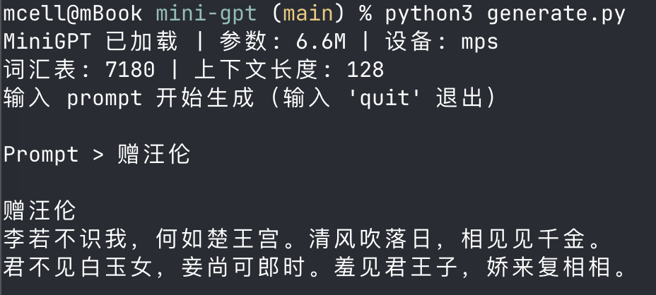

# MiniGPT · 李白 — 从零训练一个会写诗的语言模型

> 🎯 这是 LLM（大语言模型）入门的 **Hello World** 项目。
> 你不需要任何机器学习背景，只要会 Python 基础就能看懂。
>
> 用 **李白 896 首诗** 作为教材，训练一个能模仿诗仙风格的小型 GPT。约半小时跑完，能续写"将进酒""关山月"式的诗句。

<div align="center">
  
</div>

---

## 目录

- [1. 这是什么？](#1-这是什么)
- [2. 前置知识：LLM 到底是什么？](#2-前置知识llm-到底是什么)
- [3. 这个项目做了什么？](#3-这个项目做了什么)
- [4. 代码一步步拆解](#4-代码一步步拆解)
  - [4.1 数据准备：把文字变成数字](#41-数据准备把文字变成数字)
  - [4.2 训练样本：怎么教模型"预测下一个字"](#42-训练样本怎么教模型预测下一个字)
  - [4.3 模型结构：Transformer 是什么？](#43-模型结构transformer-是什么)
  - [4.4 训练循环：模型怎么学习的？](#44-训练循环模型怎么学习的)
  - [4.5 文本生成：模型怎么"写文章"？](#45-文本生成模型怎么写文章)
- [5. 自己动手跑一遍](#5-自己动手跑一遍)
  - [5.1 环境准备](#51-环境准备)
  - [5.2 准备李白诗歌数据](#52-准备李白诗歌数据)
  - [5.3 开始训练](#53-开始训练)
  - [5.4 用模型生成诗句](#54-用模型生成诗句)
- [6. 怎么读懂训练输出？](#6-怎么读懂训练输出)
- [7. 进阶：两阶段训练（预训练 + 微调）](#7-进阶两阶段训练预训练--微调)
  - [7.1 为什么需要它？](#71-为什么需要它)
  - [7.2 怎么做：先学唐诗，再专精李白](#72-怎么做先学唐诗再专精李白)
  - [7.3 一个反直觉的教训：PPL 会骗人](#73-一个反直觉的教训ppl-会骗人)
- [8. 下一步可以做什么？](#8-下一步可以做什么)
- [9. 参考资料](#9-参考资料)

---

## 1. 这是什么？

简单说：**用李白的 896 首诗作为教材，从零训练一个能续写李白风格诗句的小型 GPT 模型。**

- 模型只有 **560 万** 个参数（ChatGPT 有上千亿个）
- 在普通笔记本电脑上就能训练，**约半小时跑完**
- 训练完成后，给它一个开头（比如"大河之剑""举杯""长风吹"），它就能续写李白风的诗句

它的定位就像编程入门时的 `printf("Hello World")` —— 麻雀虽小，五脏俱全。通过这个项目，你会亲手跑通 LLM 的完整流程：**数据处理 → 模型搭建 → 训练 → 生成**。

### 为什么只选李白？

唐诗宋词混在一起训练时，风格太杂——模型变成了"古诗拼贴机"，七嘴八舌。李白诗有极强的个人风格（**酒、剑、月、仙、海**），896 首高度统一，小模型学得透。这验证了一条原则：**数据质量的集中度，比数量更重要。**

> 💡 那"数量"就完全不重要吗？也不是。第 7 章会讲一个更精妙的玩法：**先用大量唐诗打底，再用李白收尾**——既要数量的广，又要风格的专。先把第 5 章的基础版跑通，再去挑战它。

### 实际训练效果

在 Apple M2 MacBook 上用 CPU 训练 **100 轮**（含余弦学习率 + 权重绑定等优化）：

| 轮次 | PPL      | 说明                              |
| ---- | -------- | --------------------------------- |
| 1    | 1228     | 瞎猜——每个位置从三千多字里蒙      |
| 10   | 126      | 李白意象浮现——酒、剑、山水        |
| 30   | 55       | 七言节奏稳定，偶有佳句            |
| 50   | 37       | 完整四句诗，意象不跑偏            |
| 76   | 20       | 能从任何开头自然续写              |
| 100  | **15.5** | 酒/剑/月/花/海 全齐，能自己拟诗题 |

**实际生成示例：**

```
Prompt > 明月

明月明镜，余雪花不歇。夜寒歌钟，舞袖落云间。
声声落云月，衣裳花窥金宫。
玉阶下泪，送君王子肠。闲居谁识道，看花满满堂。

Prompt > 举杯

举杯中赠我缨。
少年游南少府
落花笑春色，游吴越女烟。我醉醉后雪，不肯饮白骨。
何如一杯酒，见水忽复长。

Prompt > 长风吹我何处

折山人肠断白日却春色，宫人今如流沙。
```

---

## 2. 前置知识：LLM 到底是什么？

在深入代码之前，先用最朴素的方式解释几个核心概念。

### 2.1 大语言模型（LLM）

> LLM 本质上是一个 **"下一个字预测器"**。

你给它一句话："君不见黄河之水天上"，它猜下一个字最可能是"来"。给它"举杯邀明"，它猜下一个字是"月"。

听起来很简单？是的，原理就是这么简单。ChatGPT 能写文章、翻译、编程，本质上都在做同一件事——**根据上文预测下文**，只不过它的规模大了几个数量级。

### 2.2 Token（词元）

计算机不认识汉字，只认识数字。所以我们要把文字切成小块，每个小块叫一个 **token**，然后给每个 token 分配一个数字编号。

比如"床前明月光"可以被切成：

- 按字切（字符级）：`["床", "前", "明", "月", "光"]` → 5 个 token
- 按词切（子词级）：`["床前", "明月", "光"]` → 3 个 token

这个项目用的是**字符级**切分——每个汉字就是一个 token，最简单也最好理解。

### 2.3 训练（Training）

训练就是让模型反复做"完形填空"：

```
输入：床前明月光的疑
标签：前明月光的疑是
```

模型看到"床前明月光的疑"，要预测下一个字是"是"。猜错了？损失函数（loss）会告诉它错得多离谱，然后它调整自己的参数，下次猜得更准。这个过程重复很多次，模型就慢慢学会了语言的规律——包括李白的用词偏好、七言格律、"酒/剑/月"的高频搭配。

### 2.4 损失（Loss）和困惑度（Perplexity）

- **Loss（损失）**：模型预测的"错误程度"。越小越好。
  - loss ≈ 8：基本在瞎猜
  - loss ≈ 4：学到了明显的规律
  - loss ≈ 2：预测非常准了

- **Perplexity / PPL（困惑度）**：`math.exp(loss)`，可以理解为"模型在每个位置平均犹豫几个选项"。
  - ppl ≈ 1200：每个字从一千多个候选里蒙
  - ppl ≈ 56：每个字从五六十个候选里选，已经很有把握

### 2.5 Transformer

Transformer 是当代所有 LLM 的底层架构（GPT 中的 T 就是 Transformer）。它最核心的机制叫**自注意力（Self-Attention）**：

> 读到"天生我材必有\_\_\_"时，模型通过注意力机制"回顾"前文，发现"我材"暗示价值、必有用处，加上李白最擅长的句式，于是预测空格处填"用"。

你可以粗略地理解为：注意力机制让模型能**在读到每个字时，自动找到前文中最相关的信息**。

### 2.6 模型到底是什么？

前面一直在说"模型猜字""模型训练""Transformer 结构"——但模型究竟是个什么东西？是代码？是文件？是 GPU 里的幽灵？

**一句话：模型 = 一段固定结构的代码 + 几百万个可以拧的数字。**

拆开来看。

---

#### 代码 = 骨架（固定不变）

你打开 `train.py`，里面的 `MiniGPT` 类就是这个模型的骨架：

```python
class MiniGPT(nn.Module):
    def __init__(self, vocab_size, d_model=256, ...):
        self.token_emb = nn.Embedding(vocab_size, d_model)   # 3357 × 256 个数字
        self.pos_emb   = nn.Embedding(block_size, d_model)   # 128 × 256 个数字
        self.blocks    = nn.ModuleList([TransformerBlock()...])  # 6 层注意力
        self.lm_head   = nn.Linear(d_model, vocab_size)      # 256 × 3357 个数字
```

这就像一个空架子：规定了有多少层、每层多少神经元、怎么连起来。**它不包含任何"知识"**——不记得李白写过什么诗，也不认识汉字。

你可以把它想象成**一颗没有记忆的大脑**——神经元之间的连接方式定了，但每个连接的强度还是随机的。

---

#### 参数 = 大脑里的数字（训练改变）

上面代码里每一个 `nn.Embedding`、`nn.Linear` 里面都存着大量浮点数（float32）：

```
token_emb:  3357 × 256  =  859,392  个数字
pos_emb:     128 × 256  =   32,768  个数字
6 层 blocks:            ≈  4,738,560 个数字
lm_head:    256 × 3357  =  859,392  个数字
（权重绑定后和 token_emb 共享，不计入）
─────────────────────────────────────────
参数总数                ≈  5,630,000 个数字
```

每个数字就是一个**可调的旋钮**。训练就是拧这 560 万个旋钮。

---

#### 训练前 vs 训练后：同一个骨架，完全不同的数字

```
训练前：560 万个随机数字 → ppl 1200 → 输出 "荪忆在南阳时始雪何回流估苋……"（乱码）

训练后：560 万个调好的数字 → ppl 15  → 输出 "明月明镜，余雪花不歇。夜寒歌钟，舞袖落云间。"
```

代码没变。`MiniGPT` 类还是那个 `MiniGPT` 类。**是参数文件变了。**

---

#### .pt 文件就是模型本身

训练结束，我们只保存参数：

```python
torch.save(model.state_dict(), "minigpt.pt")
```

这个 `minigpt.pt` 就是模型。25 MB 的文件，里面只有一样东西：

```
{
  "token_emb.weight":   [0.0023, -0.0142,  0.0087, ...]  一共 560 万个 float32
  "pos_emb.weight":     [-0.0031,  0.0019, -0.0066, ...]
  "blocks.0.attn.qkv.weight":  [ 0.0044, -0.0021, ...]
  ...
}
```

没有任何诗、没有任何汉字。**只有数字。** 但就是这些数字的排列，编码了"李白喜欢把'酒'和'月'放一起""七言的节奏长这样"'将进酒'后面该接什么"。

> 🧠 做个类比：
>
> **代码 = 大脑结构**（这人能听、能说、有记忆力）
> **参数 = 大脑里的记忆**（这人小时候读过李白，现在能背出来）
> **训练 = 学习过程**（反复背、反复纠正，直到记住）
>
> 把同样的代码（大脑结构）换一套参数（记忆），这个人就能从"李白风格"瞬间变成"杜甫风格"——不用换脑子，换记忆就行。

---

#### 验证一下

你现在可以去看看那个文件：

```bash
python3 -c "
import torch
ckpt = torch.load('minigpt.pt', weights_only=True)
# 这就是一堆数字的词典
for name, tensor in list(ckpt.items())[:3]:
    print(f'{name}: shape={list(tensor.shape)} 前3个值={tensor.flatten()[:3].tolist()}')
"
```

输出类似：

```
token_emb.weight: shape=[3357, 256] 前3个值=[-0.0012, 0.0047, -0.0083]
pos_emb.weight:   shape=[128, 256]  前3个值=[0.0023, -0.0061, 0.0019]
blocks.0.attn.qkv.weight: shape=[768, 256] 前3个值=[0.0033, -0.0014, 0.0056]
```

就这些。没有汉字，没有诗句，没有数据库。**只有数字。** 这就是模型。

---

## 3. 这个项目做了什么？

一张图概括：

```
御定全唐诗（900 卷 JSON，繁体）
        │
        ▼  prepare_libai.py
  筛选 author="李白" → 繁转简 → 去缺字
        │
        ▼  datas/corpus_libai.txt（896 首，10 万字）
        │
        ▼  CharTokenizer
  字符级分词器（3357 个不重复汉字 → ID）
        │
        ▼  get_batch()
  随机采样：输入前 128 字，预测下一个字
        │
        ▼  MiniGPT
  6 层 Transformer（560 万参数，含权重绑定）
        │
        ▼  AdamW + 交叉熵损失
  余弦学习率 + warmup，训练 100 轮
        │
        ▼  minigpt.pt（~25 MB）
  generate.py → 输入 "大河之剑" → 续写李白诗
```

**数据规模：**

| 指标       | 值                                   |
| ---------- | ------------------------------------ |
| 数据源     | 御定全唐诗（chinese-poetry）         |
| 李白诗总数 | **896 首**                           |
| 总字符数   | 约 10 万字                           |
| 不重复汉字 | 3,357 个                             |
| 模型参数量 | 560 万（权重绑定，实际独立参数更少） |
| 训练时间   | **约半小时**（MacBook CPU）          |

---

## 4. 代码一步步拆解

整个项目的核心代码都在 `train.py` 这一个文件里，大约 220 行。我们逐段拆解。

### 4.1 数据准备：把文字变成数字

#### 4.1.1 读入文本

```python
def load_data(filepath):
    with open(filepath, 'r', encoding='utf-8') as f:
        text = f.read()
    text = text.replace('\r\n', '\n').replace('\r', '\n')
    return text
```

做的事：打开语料文件，把整个文件读成一个字符串。然后把 Windows 风格的换行符 `\r\n` 统一换成 Unix 风格的 `\n`。

语料长这样：

```
将进酒
君不见黄河之水天上来，奔流到海不复回。
君不见高堂明镜悲白发，朝如青丝暮成雪。
人生得意须尽欢，莫使金尊空对月。天生我材必有用，千金散尽还复来。

关山月
明月出天山，苍茫云海间。长风几万里，吹度玉门关。
```

每首诗一行标题，几行诗句，一个空行分隔。干净、规整。

#### 4.1.2 字符级分词器

```python
class CharTokenizer:
    def __init__(self, text):
        chars = sorted(list(set(text)))          # 统计所有不重复字符
        self.stoi = {ch: i for i, ch in enumerate(chars)}  # 字 → ID
        self.itos = {i: ch for i, ch in enumerate(chars)}  # ID → 字
        self.vocab_size = len(chars)

    def encode(self, s):
        return [self.stoi[ch] for ch in s if ch in self.stoi]

    def decode(self, ids):
        return ''.join([self.itos.get(i, '?') for i in ids])
```

以"君不见"为例：

```python
tokenizer.encode("君不见")   # → [1234, 567, 890]（三个数字）
tokenizer.decode([1234, 567, 890])  # → "君不见"
```

> 💡 **为什么用字符级？**
> 古典诗歌中每个汉字都是独立的语义单元——"长风几万里"，每个字都不可拆分。李白 896 首诗不重复的汉字只有 3,357 个——这个"词汇表"对于模型来说非常小，字符级最合适。

#### 4.1.3 把李白全集编码

```python
data = torch.tensor(tokenizer.encode(text), dtype=torch.long)
```

执行后，`data` 就是一个长度为约 10 万的一维张量，每个元素是一个 0~3356 之间的整数。

---

### 4.2 训练样本：怎么教模型"预测下一个字"

```python
def get_batch(data, block_size, batch_size):
    ix = torch.randint(0, len(data) - block_size, (batch_size,))
    x = torch.stack([data[i:i + block_size] for i in ix])
    y = torch.stack([data[i + 1:i + block_size + 1] for i in ix])
    return x, y
```

从全集中**随机抽取** 32 段（`batch_size=32`），每段 128 个字（`block_size=128`）。

关键：**y 是 x 整体右移一位**。比如：

```
x = ["天", "生", "我", "材", "必"]     ← 模型看到的输入
y = ["生", "我", "材", "必", "有"]     ← 模型要预测的目标（每个位置都是"下一个字"）
```

这就是语言模型训练的**标准范式**：给定前文，预测下一个字。不需要人工标注——文本本身就是标签。

---

### 4.3 模型结构：Transformer 是什么？

模型由三部分拼接而成：

```
输入 ID（B, T）
     │
     ├──→ Token Embedding（3357 个汉字 → 256 维向量）
     ├──→ Position Embedding（128 个位置 → 256 维向量）
     │
     ▼
  相加 → 6 层 TransformerBlock → LayerNorm → Linear → 输出 logits
```

#### 4.3.1 嵌入层（Embedding）

```python
self.token_emb = nn.Embedding(vocab_size, d_model)  # 3357 → 256 维
self.pos_emb = nn.Embedding(block_size, d_model)     # 128 个位置 → 256 维
```

- **Token Embedding**：把每个字的 ID 映射为一个 256 维向量——"这个字的含义"。
- **Position Embedding**：把位置信息也映射为 256 维向量——Transformer 本身不关心顺序，需要显式告诉它。

两个向量**相加**送入 Transformer：

```python
x = tok_emb + pos_emb   # (32, 128, 256)
```

#### 4.3.2 TransformerBlock（Decoder 块）

每层做两件事：

1. **自注意力（Self-Attention）**：读到"举杯邀明\_\_\_"时，"举杯""邀"和"明"通过注意力机制关联到"月"，模型知道填"月"。**Causal Mask** 保证不能偷看后面的字。
2. **前馈网络（FFN）**：放大（256→1024）→ GELU 激活 → 缩回（1024→256）。这步让模型学到复杂模式——七言的节奏、对仗的结构、"酒"常跟"醉""饮""杯"一起出现。

6 层堆叠，每层外有**残差连接**（`x + attn_out`）防止深层学不动。

#### 4.3.3 关键超参数

| 参数         | 值   | 含义                            |
| ------------ | ---- | ------------------------------- |
| `vocab_size` | 3357 | 李白使用的不同汉字数            |
| `d_model`    | 256  | 每个字的表示维度                |
| `n_heads`    | 8    | 注意力头数——从 8 个角度同时关注 |
| `n_layers`   | 6    | Transformer 层数                |
| `block_size` | 128  | 一次最多看 128 个字             |
| `dropout`    | 0.1  | 随机丢弃 10% 神经元，防过拟合   |

---

### 4.4 训练循环：模型怎么学习的？

```python
for epoch in range(epochs):                    # 把李白诗过 100 遍
    for step in range(steps_per_epoch):         # 每遍约 24 步（因为只有 10 万字）
        x, y = get_batch(data, 128, 32)         # ① 随机取一批
        logits = model(x)                       # ② 前向预测
        loss = F.cross_entropy(logits, y)       # ③ 算损失
        optimizer.zero_grad()                   # ④ 清空梯度
        loss.backward()                         # ⑤ 反向传播
        clip_grad_norm_(model.parameters(), 1.0)# ⑥ 梯度裁剪
        optimizer.step()                        # ⑦ 更新参数
```

| 步骤 | 通俗理解                   |
| ---- | -------------------------- |
| ①    | 翻开李白集，随机挑 32 段   |
| ②    | "我猜下一个字是…"          |
| ③    | "你猜错了 60%！"           |
| ④⑤⑥  | 算出每个参数该往哪个方向改 |
| ⑦    | 微调所有 560 万个参数      |

> 💡 **为什么 100 轮？**
> 数据量小（10 万字），模型容量也小（560 万参数），100 轮不会过拟合。配合**余弦学习率**（前期大步快学、后期小步精调）和 **warmup**（前 10% 步数 lr 从 0 线性爬升，避免初期方向不稳），收敛更深更稳。

---

### 4.5 文本生成：模型怎么"写诗"？

```python
@torch.no_grad()
def generate(self, idx, max_new_tokens, temperature=1.0, top_k=None):
    for _ in range(max_new_tokens):
        idx_cond = idx[:, -self.block_size:]      # 只保留最后 128 字
        logits = self(idx_cond)                   # 预测下一个字
        logits = logits[:, -1, :] / temperature   # 除以温度
        if top_k is not None:                     # 只在概率最高的 k 个字里采样
            v, _ = torch.topk(logits, top_k)
            logits[logits < v[:, [-1]]] = -float('inf')
        probs = F.softmax(logits, dim=-1)         # 得分 → 概率
        idx_next = torch.multinomial(probs, 1)    # 按概率采样
        idx = torch.cat((idx, idx_next), dim=1)   # 拼回去
    return idx
```

**自回归生成**：每次只产生一个字，拼回原文，再产下一个字。像多米诺骨牌。

**temperature 参数**：控制创造力。

| temperature     | 效果                     |
| --------------- | ------------------------ |
| 0.5             | 保守，工整但重复         |
| **0.8**（默认） | 平衡                     |
| 1.2+            | 狂野，偶有惊艳的意外组合 |

**top_k 参数**：每步只在概率最高的 `k` 个字里采样（默认 `top_k=40`），把长尾的低概率乱码字直接排除，明显减少"源源源源"这类失控重复，让句子更连贯。

---

## 5. 自己动手跑一遍

### 5.1 环境准备

```bash
pip install torch opencc requests
```

### 5.2 准备李白诗歌数据

```bash
python3 prepare_libai.py
```

这个脚本做三件事：

1. 从 [chinese-poetry](https://github.com/chinese-poetry/chinese-poetry) 仓库下载御定全唐诗（900 卷 JSON，繁体）
2. 筛出 `author="李白"` 的诗（896 首）
3. 繁体→简体（opencc），去缺字、去噪声字符，输出 `datas/corpus_libai.txt`（约 10 万字，3333 个不重复汉字）

> 💡 字符清理由 `clean.py` 统一负责：只保留汉字和中文标点，过滤混入的字母、数字、生僻乱码字。干净的语料 = 干净的词表。

### 5.3 开始训练

```bash
python3 train.py --cpu
```

**约半小时跑完。**

训练中会每隔 5 轮输出一个生成样本——你能亲眼看到模型从乱码到诗句的进化过程。

```
vocab: 3357 | params: 5.6M | device: cpu | block: 128
steps_per_epoch: 24

epoch  1/100  ppl = 1227.8
  [生成样本] 荪。忆在南阳时……

epoch 10/100  ppl = 125.6
  [生成样本] 畴昔雄豪如梦子……春风满玉……

epoch 30/100  ppl = 55.2
  [生成样本] 龙马花雪毛，金鞍白发崔嵬……

epoch 50/100  ppl = 37.3
  [生成样本] 姬髡发入舂市，万古共肝肠……

epoch 76/100  ppl = 20.5
  [生成样本] 我似鹧鸪鸟……浮云立不遇……长书谢明游。

epoch 100/100  ppl = 15.5
  [生成样本] 君王多乐事，还与万方没。

✅ 模型已保存到 minigpt.pt
```

### 5.4 用模型生成诗句

```bash
python3 generate.py
```

```
MiniGPT 已加载 | 参数: 5.6M | 词表: 3357

Prompt > 明月
明月明镜，余雪花不歇。夜寒歌钟，舞袖落云间。
声声落云月，衣裳花窥金宫。
玉阶下泪，送君王子肠。闲居谁识道，看花满满堂。

Prompt > 举杯
举杯中赠我缨。少年游南少府
落花笑春色，游吴越女烟。我醉醉后雪，不肯饮白骨。
何如一杯酒，见水忽复长。

Prompt > 长风吹我何处
折山人肠断白日却春色，宫人今如流沙。

Prompt > quit
```

---

## 6. 怎么读懂训练输出？

| 输出           | 含义                                 |
| -------------- | ------------------------------------ |
| `vocab: 3357`  | 李白使用的不同汉字数                 |
| `params: 5.6M` | 模型参数量                           |
| `step 0/24`    | 当前 epoch 第 0 步 / 总共 24 步      |
| `epoch 1/100`  | 第 1 轮完成 / 共 100 轮              |
| `ppl = 1227`   | 困惑度——模型在每个位置平均犹豫几个字 |
| `[生成样本]`   | 训练中途的续写效果                   |

**PPL 下降的正常节奏：**

| PPL     | 模型状态                   |
| ------- | -------------------------- |
| 1000+   | 随机初始化，纯瞎猜         |
| 200-500 | 学会高频字搭配，出完整句子 |
| 100-200 | 李白意象浮现——酒、剑、月   |
| 50-100  | 七言节奏稳定，偶有佳句     |
| < 50    | 学得很好了                 |

---

## 7. 进阶：两阶段训练（预训练 + 微调）

> 📌 前面第 5 章训出的模型，已经很像李白了。但如果你仔细读它写的诗，会发现两个毛病：**诗句之间的联系不强**（上一句和下一句像各写各的），**有些词语搭配很奇怪**（"不肯饮白骨"这种）。
>
> 这一章解决这两个问题。它是本项目里最接近"真实大模型怎么训练"的部分——**ChatGPT 也是这么练出来的**。

### 7.1 为什么需要它？

先回到病根。我们让你数过一个数：李白全集只有 **10 万字**。这意味着什么？

- 模型有 **560 万个参数**（旋钮），却只有 10 万字可学 —— **平均每个旋钮只摊到 0.018 个字**。
- 更糟的是，李白诗里 **66% 的"两字搭配"只出现过一次**，**83% 的"三字搭配"只出现过一次**。

> 💡 打个比方：让一个学生只读一遍课文就考试。出现过很多次的词（"明月""黄河"）他记得牢，但只见过一次的搭配，他基本是**蒙**的。你看到的"词语搭配怪"，就是模型在蒙。

**这不是模型不够大，恰恰相反——是数据太少。** 那解决办法很自然：**给它看更多诗**。

但这里有个陷阱，本项目开头就警告过（见"为什么只选李白"）：**直接把几百万字唐诗宋词一股脑灌进去，模型会变成"古诗拼贴机"，丢掉李白的个人风格。**

怎么办？既要数据的"广"，又要风格的"专"。答案就是 —— **分两步走**。

### 7.2 怎么做：先学唐诗，再专精李白

```
第一步：预训练（Pre-training）
  192 万字唐诗（2.3 万首，各种诗人）
        │  让模型先学会"汉字怎么搭、七言怎么走、对仗长什么样"
        ▼  —— 不要求像李白，只要求"像首诗"
  minigpt_pretrain.pt（一个有"通用诗歌语感"的模型）
        │
第二步：微调（Fine-tuning）
  10 万字李白全集
        │  在预训练的基础上，只学李白
        ▼  —— 把通用语感"拉"成李白风格
  minigpt.pt（最终模型：底子厚 + 风格专）
```

> 🧠 再打个比方：
> - **预训练** = 让学生先广泛阅读几千首唐诗，培养"诗感"。他还不是李白专家，但已经懂诗了。
> - **微调** = 再让他专攻李白。因为有了诗感的底子，他这次能学得又快又像。
>
> 这正是大模型的标准套路：**先在海量文本上预训练（学通用语言能力），再在特定数据上微调（学专门任务）。** GPT、Claude 全都是这么来的——你这个小项目，麻雀虽小，跑通了一样的流程。

**动手跑（约半小时）：**

```bash
# 0. 先下载唐诗作为预训练语料（约 192 万字）
python3 prepare_tang.py

# 1. 预训练：在唐诗上训 12 轮，产出"通用诗歌底座"
python3 train.py --data datas/corpus_tang.txt --out minigpt_pretrain.pt --epochs 12

# 2. 微调：从预训练权重出发，在李白上训 40 轮
python3 train.py --data datas/corpus_libai.txt --init-from minigpt_pretrain.pt --out minigpt.pt --epochs 40

# 3. 生成（和之前一样）
python3 generate.py
```

> 💡 **两个关键设计：**
> 1. **共享词表**：预训练和微调必须用同一张"字→数字"对照表（`datas/vocab.json`，由唐诗+李白的字**并集**构成，共 7180 字），否则两个阶段的数字对不上。第一次运行时脚本会自动生成它。
> 2. **微调用更小的学习率**（`--init-from` 时自动从 3e-4 降到 1e-4）：步子迈小点，免得把预训练学到的东西一下冲掉。

### 7.3 一个反直觉的教训：PPL 会骗人

这是本章最值得记住的一点。

跑完两阶段，我们自然想问："变好了吗？"于是去看 PPL（困惑度，第 2.4 节讲过，越低越好）。结果傻眼了：

| 模型 | 在李白诗上的表现（BPC，越低越好） |
|------|-------------------------------|
| 纯李白（第 5 章） | **3.54** ✅ 更低 |
| 两阶段（本章） | 4.59 ❌ 更高 |

**纯李白模型的指标反而更好？** 难道两阶段白做了？

别急。问题出在**我们量错了东西**。这个指标测的是"模型对**李白训练集**预测得多准"——而：

- **纯李白模型指标低，是因为它在"背书"。** 数据少、词表小，它把那 10 万字**背了下来**。考"原文填空"当然得高分。
- **两阶段模型指标高，是因为它在"创作"。** 它见过 192 万字，写诗时不是默写李白，而是**用学到的规律现场创作**。在"背原文"这项上吃亏，但这恰恰说明它**没有死记硬背**。

> ⚠️ **关键认知**：
> **PPL/BPC 衡量的是"记忆"，不是"创作质量"。** 对写诗这种审美任务，**唯一靠谱的评判标准是你自己的眼睛和耳朵**——读出来通不通顺、像不像李白。
>
> 这是新手最容易踩的坑：盯着一个漂亮的数字，却忘了数字测的根本不是你想要的东西。**指标是工具，不是目的。**

实际读一读两阶段模型的输出，你会发现它确实改善了开头说的两个毛病：

```
Prompt > 长风
长风摇落月，长啸归风生。
赠梁甫
白石白纻辞金陵，黄沙挂帆挂锦城。
昨夜长吟天上吟，今夕一吟此中乐。
```

"白石白纻辞金陵，黄沙挂帆挂锦城"——**对仗工整、上下句呼应**，比纯李白版的连贯性明显更好。这就是预训练给的"诗感"在起作用。

> 🎯 **本章小结**：
> - 数据太少 → 搭配学不透 → 用**预训练**补广度，用**微调**保风格
> - 这是大模型的标准范式，你已经亲手跑通
> - **别迷信指标**：写诗好不好，你说了算

---

## 8. 下一步可以做什么？

- **换诗人**：改 `prepare_libai.py` 里的 `author="李白"` 为 `author="杜甫"`、`author="苏轼"`，立刻得到另一风格
- **调大模型**：把 `d_model` 从 256 改到 384，`n_layers` 从 6 改到 8
- **加更多诗**：改代码筛 `author="李白"` 的同时也加入宋词中的李白词作
- **玩 temperature**：`python3 generate.py --temperature 1.5` 看狂野李白
- **试试两阶段训练**：跟着第 7 章，先唐诗预训练再李白微调，亲手感受"诗句连贯性"的提升
- **扩大预训练语料**：`prepare_tang.py` 默认只下 ~190 万字，改大目标字数下更多唐诗，看预训练底座更厚后效果如何

---

## 9. 参考资料

- [chinese-poetry](https://github.com/chinese-poetry/chinese-poetry) — 最全的中华古典诗词开源数据集
- [Attention Is All You Need](https://arxiv.org/abs/1706.03762) — Transformer 原始论文
- [karpathy/minGPT](https://github.com/karpathy/minGPT) — 本项目架构的灵感来源
- [The Roads for LLM](https://mcell.top/books/the-roads-for-llm/train-small-gpt) — 配套中文教程
